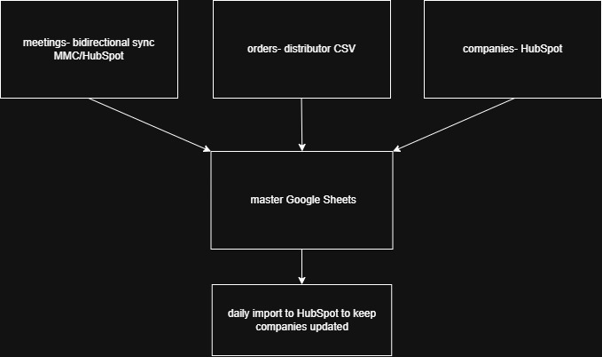
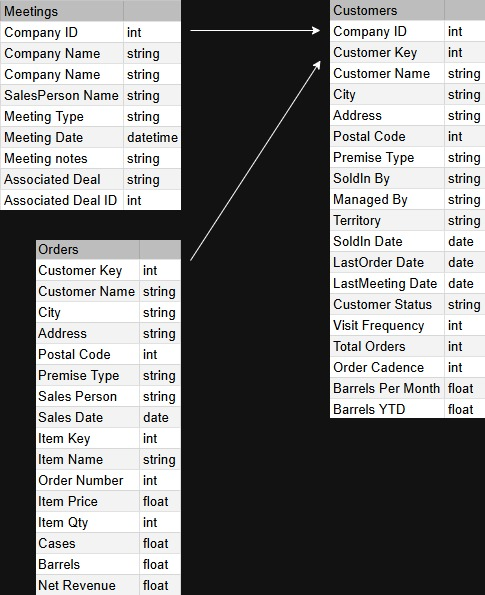
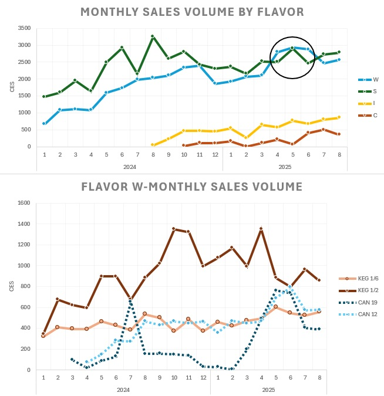

# Project Background
This project supports a small B2B craft beer company that distributes packaged product through a third-party distributor while managing sales activity internally through a CRM. Sales data was received in periodic CSV files from the distributor and existed separately from customer and deal data tracked in HubSpot and Map My Customers (MMC). As a result, leadership lacked a consistent, reliable view of product movement, account performance, and sales rep effectiveness.

The goal of this project was to design a centralized analytics workflow that connected distributor sales data with internal CRM data, standardized customer and product records, and enabled ongoing reporting while minimizing manual intervention. The solution focused on building a clean data structure, automating daily ingestion, and delivering clear performance insights to non-technical stakeholders across sales and operations.

# Data Structure Overview

|Orders         |type   |
|---------------|--------|
| Customer Key  | int    |
| Customer Name | string |
| Address       | string |
| City          | string |
| Postal Code   | int    |
| Premise Type  | string |
| Sales Person  | string |
| Sales Date    | date   |
| Order Number  | int    |
| Item Key      | int    |
| Item Name     | string |
| Item Price    | float  |
| Item Qty      | int    |
| Cases         | float  |
| Barrels       | float  |
| Net Revenue   | float  |

|Meetings            |type      |
|--------------------|----------|
| Company ID         | int      |
| Company Name       | string   |
| SalesPerson Name   | string   |
| Meeting Type       | string   |
| Meeting Date       | datetime |
| Meeting notes      | string   |
| Associated Deal    | string   |
| Associated Deal ID | int      |

|Companies          |type    |
|-------------------|--------|
| Record ID         | int    |
| Customer Key      | int    |
| Customer Name     | string |
| City              | string |
| Address           | string |
| Postal Code       | int    |
| Premise Type      | string |
| SoldIn By         | string |
| Managed By        | string |
| Territory         | string |
| SoldIn Date       | date   |
| LastOrder Date    | date   |
| LastMeeting Date  | date   |
| Customer Status   | string |
| Visit Frequency   | int    |
| Total Orders      | int    |
| Order Cadence     | int    |
| Barrels Per Month | float  |
| Barrels YTD       | float  |


# Process Review
The existing workflow relied on a network of interdependent Google Sheets used to manually ingest, clean, and reconcile daily distributor order CSVs against HubSpot customer records. Each incoming file required hands-on validation, copy/paste transformations, and manual joins to CRM exports in order to align orders with accounts, territories, and sales ownership.





This process introduced several constraints:
* High manual intervention: Daily reconciliation consumed significant sales leadership time, reducing capacity for coaching, distributor coordination, and pipeline management.
* Delayed visibility: Reporting lagged behind actual sales activity, limiting the usefulness of weekly rep reviews and senior KPI dashboards.
* Limited scalability: As order volume, SKUs, and sales reps increased, the system required proportional increases in manual effort and became increasingly unsustainable.
* Poor auditability: Historical changes to customer attributes and order mappings were difficult to trace, limiting confidence in reported metrics.

As a result, sales operations and leadership were forced to prioritize data preparation over analysis and decision-making, constraining the organization’s ability to respond quickly to performance trends and account-level risks.


# Methods
Implemented automated CSV ingestion of distributor order data via email-triggered Azure Logic Apps. Files are written to Azure Blob Storage and processed by a SQL Server stored procedure.

**Merging logic to prevent duplicate records**
```sql
BULK INSERT [dbo].[BulkOrders]
FROM 'MergeTheseOrders.csv'
WITH (
    DATA_SOURCE = 'AzureBlobStorage',
    FORMAT = 'CSV',
    FIRSTROW = 2
);
......
-- matching logic prevents any duplicate line items
ON Target.[OrderNumber] = Source.[OrderNumber] --matching on OrderNumber
AND Target.[SalesDate] = Source.[SalesDate] -- matching on SalesDate
AND Target.[ItemName] = Source.[ItemName] -- Matching on ItemName
AND Target.[Package] = Source.[Package] -- Matching on Package
AND Target.[Cases] = Source.[Cases] -- Matching on Cases
WHEN NOT MATCHED THEN
    INSERT (
......
```
Maintained a RawOrders table to preserve all inbound distributor data and a CleanOrders table applying custom business logic, schema normalization, and derived metrics.

Created SQL views to reconcile order data with CRM company records and identify mismatches and enrichment gaps.

**Cleaning and reconciling conflicting propertiess**
```sql
CASE WHEN N.[CusName] like '%Sample%' then 1 else 0 end as Sample,
CASE 
    WHEN N.[SrsPremiseType] like 'Off%' and N.[Package] like 'KEG%' then 'Y'
    WHEN HL.[Rotator_Y_N] is null then 'Y'
    ELSE HL.[Rotator_Y_N] 
end as Rotator,
CASE
    WHEN N.[SrsPremiseType] like 'Off%' and N.[Package] like 'KEG%' then 'ON'
    WHEN N.[SrsPremiseType] like 'Off%' then 'OFF'
    WHEN N.[SrsPremiseType] like 'On%' then 'ON' 
    WHEN N.[SrsPremiseType] is null and HL.[Premise_Type] like 'On%' then 'ON'
    WHEN N.[SrsPremiseType] is null and HL.[Premise_Type] like 'Off%' then 'OFF'
END as RealPremise,
```

**Adding derived columns for order frequency metrics. Allows flagging of new accounts and accounts buying new SKUs.**
```sql
,ROW_NUMBER() OVER(PARTITION BY Cuskey ORDER BY COH.SalesDate) as RowNumCus
,ROW_NUMBER() OVER(PARTITION BY COH.Cuskey, COH.ItemName ORDER BY COH.SalesDate) as RowNumSKU
,LAG(COH.SalesDate) OVER(PARTITION BY COH.Cuskey ORDER BY COH.SalesDate) as PreviousOrderDateCus
,LAG(COH.SalesDate) OVER(PARTITION BY COH.Cuskey, COH.ItemName ORDER BY COH.SalesDate) as PreviousOrderDateSKU
,MIN(COH.SalesDate) OVER(PARTITION BY COH.Cuskey) as FirstOrderCus
,MIN(COH.SalesDate) OVER(PARTITION BY COH.Cuskey, COH.ItemName) as FirstOrderSKU
```

Built a Python-based HubSpot API integration to pull current company records and properties into SQL Server on a scheduled basis.

Pushed curated company updates back to HubSpot to maintain a single source of truth across systems.


# Insights
Sales concentration: A small, consistent subset of accounts drives a disproportionate share of revenue, indicating a clear Protect/Grow account segment.

SKU mix: The original launch flavor is starting to be outperformed by another, suggesting shifting customer preferences. Newer flavors gaining traction. Growth in flavor W largely contributed by one SKU.



Sales activity: Historical sales outreach showed high variability across reps. Introducing minimum activity benchmarks, combined with reduced administrative overhead, increased outreach volume by 50%+ for newer reps.

Better access to 


# Recommendations
Reduce CRM complexity- sales reps should only use HubSpot for meeting activities to eliminate need for integration and managing multiple apps. Reduce MMC licenses down to 1, saving ~$10k/year. One MMC superuser can perform all territory and mapping tasks

Set ambitious but reasonable expectations for rep activity. Incentives for meeting standards

Aggressively market newer SKUs to capitalize on shifting consumer preferences and grow those points of distribution.
